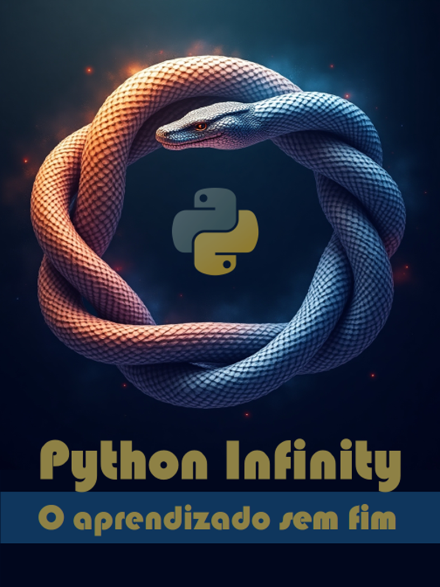

# Projeto EBOOK Gerado por I.A.s

 > ℹ️ **NOTE:** Este é o repositório desenvolvido durante o curso no qual fui instrutor técnico na plataforma da [DIO](https://dio.me)

Projeto com o objetivo de gerar um ebook digital com as facilidades das ferramentas de IA. todos os prompts
seguem abaixo.

<a href="https://github.com/felipeAguiarCode/prompts-recipe-to-create-a-ebook/blob/main/output/ebook%20-%20css%20jedi%20output.pdf" title="View PDF now"> 📕Clique aqui para ler</a>

## 💻 Tecnologias utilizadas no projeto

- [ChatGPT](https://chat.openai.com/) 
- [MidJourney](https://www.midjourney.com/app/)
- [PowerPoint](https://www.microsoft.com/en/microsoft-365/powerpoint)

## 🧠 Prompts

ChatGPT：

|   Ação   | prompt                                                                                                                                                                                                                                                                         |
| :------: | ------------------------------------------------------------------------------------------------------------------------------------------------------------------------------------------------------------------------------------------------------------------------------ |
|  título  | Crie um título de um ebook sobre o tema de Python, o ebook é do nicho de programação, o título deve ser épico e curto, e tenha uma temática de possibilidades na área de programação, me liste 5 variações de títulos                                                        |
| conteúdo | Faça um Ebook, com foco em aprendizado em Python, listando e citando três possibilidades de projetos inovadores que podem ser feitos em Python, com exemplos em código. {REGRAS} Explique sempre de uma maneira simples e objetiva. Deixe o texto enxuto. Sempre traga exemplos de código em contextos reais e explique seu funcionamento. Sempre deixe um titulo sugestivo por tópico. |

Midjourney：

|  Ação  | prompt                                                                                 |
| :----: | -------------------------------------------------------------------------------------- |
| título | A Yellow and blue snake, eating herself like an Ouroboros, on a dark blue backgorund, Vivid style --v 6.1 |

## ✨ Features

- Conteúdo gerado via ChatGPT
- Imagens geradas via MidJourney

## 📚 Materiais

- Imagens utilizadas em `assets`
- ebook gerado durante as aulas em `output`
